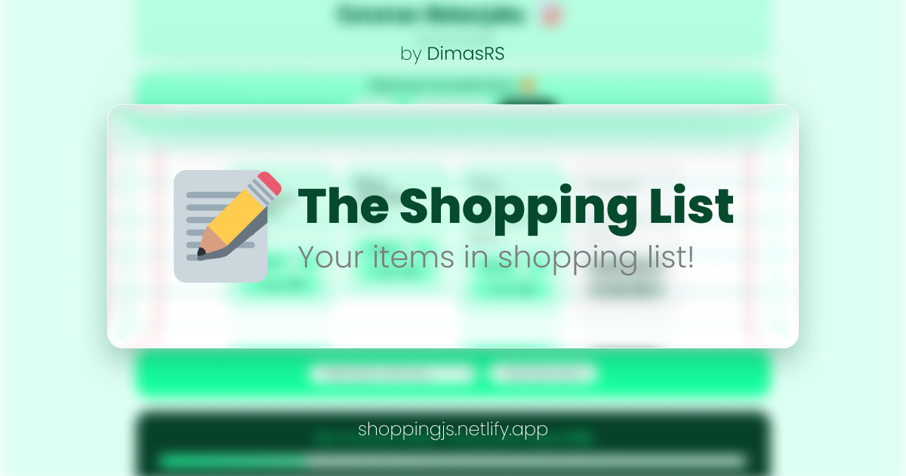

# 🛒 Your shopping list!

**Add your items into this short-simple memo here!**

Basically you can:

-   ✏️ Add your items
-   ✅ Dont forget to check if they're done!
-   ❎ Remove it
-   🏳️ Track your progress
-   ⚙️ Also sort it by: newest, name, and check

## ⚛️ My first react app!

_Aside from that, it's built with pure vanilla HTML and CSS.\*_

---
